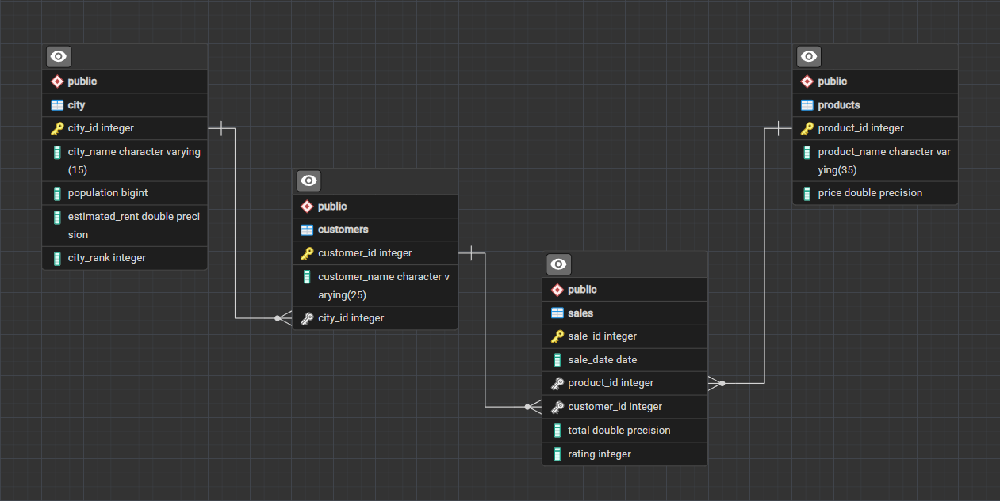

# Monday Coffee: SQL Market Analysis

A PostgreSQL analysis of coffee product sales across 14 Indian cities. It answers ten business questions and ends with a recommendation of three cities by market potential, weighing revenue, customer base, estimated coffee consumers and rent.

## Dataset

Four related tables (see `erd.png`). Import in this order: `city`, `products`, `customers`, `sales`.

| Table | Rows | Columns |
|---|---|---|
| `city` | 14 | city_id, city_name, population, estimated_rent, city_rank |
| `products` | 28 | product_id, product_name, price |
| `customers` | 497 | customer_id, customer_name, city_id |
| `sales` | 10,388 | sale_id, sale_date, product_id, customer_id, total, rating |

- Sales run from 1 January 2023 to 1 October 2024, with total revenue of 6,070,190.
- The last month, October 2024, contains a single day of sales.
- Estimated coffee consumers are assumed to be 25% of each city's population.



## Business Questions

| # | Question | SQL used |
|---|---|---|
| 1 | Estimated coffee consumers per city | Aggregation, ROUND |
| 2 | Revenue in Q4 2023, total and by city | EXTRACT, multi-table JOIN |
| 3 | Number of orders per product | LEFT JOIN, GROUP BY |
| 4 | Revenue and average sale per customer by city | COUNT DISTINCT, casting |
| 5 | Unique customers vs estimated consumers per city | CTEs |
| 6 | Top 3 products in each city | DENSE_RANK, subquery |
| 7 | Unique coffee-product customers per city | LEFT JOIN, IN |
| 8 | Average sale vs average rent per customer | CTEs |
| 9 | Month-over-month sales growth by city | LAG, CTEs |
| 10 | Market potential of the top cities | CTEs, joins across all four tables |

## Key Findings

- **Coffee consumers:** Delhi has the largest estimated market at 7.75 million consumers, followed by Mumbai (5.10M) and Kolkata (3.72M).
- **Q4 2023 revenue:** 1,963,300 in total. Pune led with 434,330, ahead of Chennai (302,500) and Bangalore (270,780).
- **Products:** Cold Brew Coffee Pack (6 Bottles) was the most ordered with 1,326 orders, then Ground Espresso Coffee (1,271) and Instant Coffee Powder (1,226). The Ceramic Coffee Mug was the least ordered with 73.
- **Revenue by city:** Pune was first overall at 1,258,290, with the highest average sale per customer (24,197.88). Chennai (944,120) and Bangalore (860,110) followed.
- **Rent per customer:** Jaipur is the lowest of all 14 cities at 156.52. Pune is 294.23 and Delhi is 330.88.
- **Customer base:** Jaipur (69 customers) and Delhi (68) have the most customers of any city.

## Recommendation

| City | Why |
|---|---|
| Pune | Highest revenue, high average sale per customer, and low rent per customer |
| Delhi | Largest estimated coffee market, 68 customers, rent per customer of 330.88 |
| Jaipur | Most customers (69) and the lowest rent per customer (156.52) |

Pune is first by revenue. Delhi and Jaipur are fifth and fourth by revenue, so they were chosen on market size, customer count and rent rather than sales alone.

## Notes

- October 2024 has one day of data, so the month-over-month figure for that month (Q9) is not comparable to full months.
- Q3 counts orders. Every sale row has a total equal to the product price, so each order is one unit.
- Run the queries in `solutions.sql` one at a time.

## Tools Used

- PostgreSQL, pgAdmin
- SQL: joins, CTEs, window functions (`DENSE_RANK`, `LAG`), subqueries, date functions

## Files

```text

data/
├── city.csv
├── customers.csv
├── products.csv
└── sales.csv

images/
└── database-schema.png

sql/
├── schemas.sql
└── solutions.sql

README.md
```

## Author

**Hrithik Doiphode**
GitHub: https://github.com/Hrithikdoi
